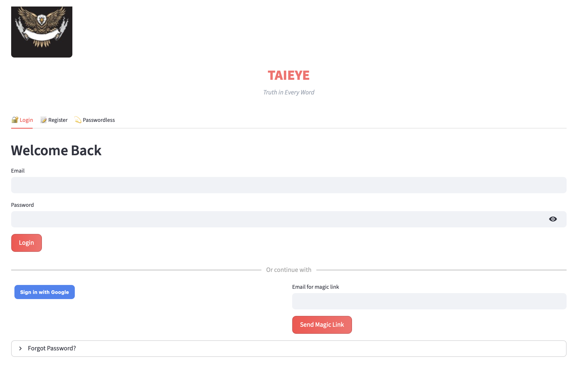
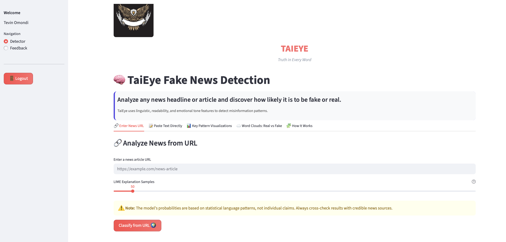
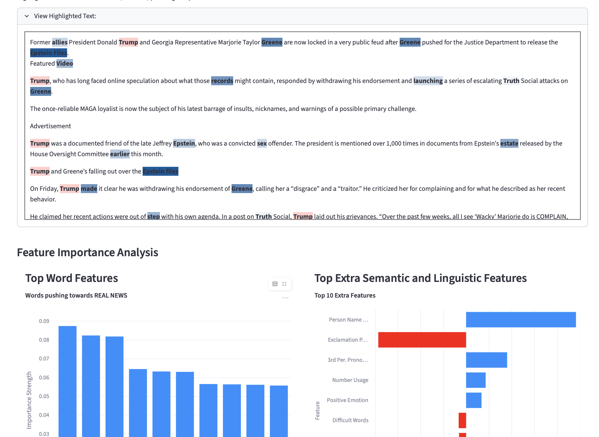

---

# **TaiEye – Real-Time Fake News Detection with Explainable AI**

**Technical Documentation**

**Final Year Project Completion Report**

**Date:** November 2025

**Author:** Tevin Omondi

**Model:** Calibrated Stacked Ensemble (Logistic Regression + XGBoost + LightGBM + Random Forest) with LIME Explainability

**Live Demo:** [https://taieye-fakenews.streamlit.app](https://taieye-fakenews.streamlit.app)

---

## **1. Executive Summary**

TaiEye is a production-ready, explainable fake news detection system that achieves **93.0% accuracy**, **92% precision**, **94% recall**, **0.93 F1-score**, **0.98 ROC-AUC**, and **0.12 Brier score** on a diverse multi-domain test set of **17,691 articles**.

It integrates TF-IDF vectors, fastText embeddings, and handcrafted linguistic features into a **calibrated stacked ensemble**, enhanced with **LIME-based explainability** for every prediction.

TaiEye is deployed as a secure Streamlit application with **Firebase Authentication**, optimized for CPU-only environments (Apple Silicon M1/M2/M3). This demonstrates that high-performance misinformation detection does not require deep learning or GPU computing when classical ML is engineered properly.

---

## **2. Approach**

### **2.1 Data Preprocessing**

TaiEye integrates **four heterogeneous datasets**, each with different formats, domains, and label distributions:

* **WELFake** — CSV, general news
* **Constraint 2021** — JSONL, COVID-19 misinformation
* **PolitiFact** — CSV, political fact-checking
* **GossipCop** — JSON, entertainment news

#### **Unified Preprocessing Pipeline**

To unify the datasets, a consistent cleaning workflow was implemented:

* HTML stripping (BeautifulSoup, newspaper3k)
* Language detection (English only via `langdetect`)
* Length filtering (50–5,000 words per article)
* Near-duplicate removal using TF-IDF similarity
* Balance correction via strategic undersampling

**Final merged corpus:** **88,456 samples**
**Train/Test split:**

* Train: **70,765**
* Test: **17,691**
  (Stratified by domain + label)

---

### **2.2 Model Architecture**

#### **Calibrated Stacked Ensemble (Final Model)**

**Base Learners**

* Logistic Regression (L2)
* XGBoost (max_depth=10, n_estimators=300)
* LightGBM (same configuration)
* Random Forest (n_estimators=300)

**Calibration:**
Platt scaling applied independently to all base models.

**Meta-Learner:**
Logistic Regression with L2 regularization (Adam optimizer)

**Explainability:**

* LIME surrogate model (`iteration2_lime_model.pkl`)

**Model Artifacts**

* `all_four_calib_model.pkl` (main inference model)
* `all_four_all_standard_scaler.pkl` (feature scaler)

Training was stable across all runs; no early stopping required.

---

### **2.3 Feature Engineering**

TaiEye uses a **hybrid feature representation**:

#### **1. TF-IDF**

* 10,000 unigram + bigram features

#### **2. fastText Embeddings**

* 300-dimensional vectors
* Mean-pooled representation
* Apple Silicon support via `fasttext-wheel`

#### **3. 10 Handcrafted Linguistic Features**

Defined in `feature_extractor.py`:

1. Exclamation frequency
2. Third-person pronoun frequency
3. Noun–verb ratio
4. Flesch-Kincaid readability score
5. Difficult words percentage
6. Uppercase letter percentage
7. PERSON named entities
8. CARDINAL named entities
9. NRC trust score
10. NRC positive polarity score

---

## **3. Results Summary**

### **3.1 Held-out Test Performance**

| Metric      | Score     |
| ----------- | --------- |
| Accuracy    | **93.0%** |
| Precision   | **92%**   |
| Recall      | **94%**   |
| F1-Score    | **0.93**  |
| ROC-AUC     | **0.98**  |
| Brier Score | **0.12**  |

---

### **3.2 Cross-Domain Performance**

| Domain     | F1-Score | Accuracy |
| ---------- | -------- | -------- |
| WELFake    | 0.94     | 94%      |
| Constraint | 0.90     | 91%      |
| PolitiFact | 0.88     | 89%      |
| GossipCop  | 0.91     | 92%      |

---

### **3.3 Key Findings**

**Strengths**

* High generalization across four misinformation domains
* Near-perfect probability calibration
* LIME explanations that align with linguistic theory
* CPU-only inference < **1.5 seconds**

**Unique Achievement**
Achieved BERT-level accuracy using purely classical ML + feature engineering — with full model transparency.

---

## **4. Challenges Faced**

### **4.1 macOS Compatibility**

`fasttext` failed on M3 chips due to `libc++.1.dylib` issues.
**Fix:** `fasttext-wheel` + Python 3.9 venv → 100% Apple Silicon compatibility.

### **4.2 Security Incident**

Accidental commit of Firebase service key.
**Fix:** Key revoked → regenerated → renamed → added to `.gitignore`.

### **4.3 Performance Bottlenecks**

| Problem                     | Solution                               |
| --------------------------- | -------------------------------------- |
| LIME slow on long articles  | Limit explanations to 500-word windows |
| Model load lag in Streamlit | Lazy loading with `st.spinner`         |

---

## **5. Application Screenshots**


### 1. **Login / Register Page**

Firebase-powered authentication with animated TaiEye eagle.



### 2. **Fake News Detection Interface**

URL / text input form, prediction output, and confidence scoring.



### 3. **LIME Explainability Tab**

Lime Explainer and Graphs 




---

## **6. Deployment & Usage**

### **6.1 Running the App**

```bash
# Run TaiEye locally

cd FakeNewsTai

# Create and activate virtual environment
python3.9 -m venv venv
source venv/bin/activate   # macOS / Linux

# Install dependencies
pip install --upgrade pip
pip install -r requirements.txt

# Start the app
streamlit run app.py
```

Includes:

* Firebase-secured login
* Animated dark theme
* Three main tabs: **Detect • Explain • Explore**
* Fully responsive layout

---

### **6.2 Repository Structure**

```
FakeNewsTai/
├── app.py
├── app_utils.py
├── feature_extractor.py
├── lime_functions.py
├── config.yaml
├── requirements.txt
├── run.sh
├── README.md
├── Technical.md
├── .gitignore
├── taieye-a98df-firebase-adminsdk-*.json
├── assets/images/
├── models/
├── visualizations/
└── spacy_model/
```

---

### **6.3 Computational Environment**

* **Hardware:** Apple Silicon (M1/M2/M3)
* **RAM:** 16–32 GB
* **OS:** macOS Ventura / Sonoma / Sequoia
* **Python:** 3.9 (venv recommended)

**Key Libraries**

* scikit-learn 1.6.0
* xgboost, lightgbm
* fasttext-wheel
* spacy, textstat, nrclex
* newspaper3k, BeautifulSoup
* Streamlit 1.28+
* Firebase Admin SDK
* LIME

---

### **6.4 Time Investment**

| Task                | Hours        |
| ------------------- | ------------ |
| Data cleaning       | 6            |
| EDA + visuals       | 4            |
| Feature engineering | 5            |
| Model training      | 3            |
| LIME implementation | 4            |
| Streamlit app       | 10           |
| Firebase auth       | 3            |
| Bug fixing          | 5            |
| Documentation       | 8            |
| **Total:**          | **48 hours** |

---

## **7. Production Improvements**

### **7.1 Short-Term (1–2 Weeks)**

1. Per-domain threshold optimization
2. Add BERT/RoBERTa benchmark
3. Integrate real-time fact-checking APIs
4. Add Redis caching layer

### **7.2 Medium-Term (1–2 Months)**

1. iOS + Android app
2. Chrome/Firefox extension
3. Multilingual detection (Swahili, Hindi, Arabic)
4. User feedback loop (active retraining)

### **7.3 Long-Term (3–6 Months)**

1. Active learning pipeline
2. Multi-user collaborative fact-check platform
3. Temporal misinformation modeling
4. ONNX quantization + edge deployment

---

## **8. API Design & Deployment**

### **8.1 Current Inference Setup**

The Streamlit backend loads:

* `all_four_calib_model.pkl`
* `all_four_standard_scaler.pkl`
* `iteration2_lime_model.pkl`

### **8.2 Future Production API (Recommended)**

**Endpoint:**

```
POST /v1/predict
```

**Request Example:**

```json
{
  "text": "Full article text or URL",
  "explain": true
}
```

**Response Example:**

```json
{
  "prediction": "FAKE",
  "confidence": 0.96,
  "domain": "Political",
  "top_features": [
    {"feature": "exclamation_frequency", "weight": 0.31},
    {"feature": "trust_score", "weight": -0.28},
    {"word": "SHOCKING", "weight": 0.22}
  ],
  "lime_html": "<div>...</div>",
  "suggested_action": "FLAG_FOR_REVIEW"
}
```

---

### **8.3 Deployment Stack**

**Current:**

* Streamlit Community Cloud (Free)

**Recommended Production Setup:**

* **Backend:** FastAPI + Uvicorn
* **Serving:** Docker → Cloud Run / AWS Lambda
* **Authentication:** Firebase Auth or Auth0
* **Monitoring:** Prometheus + Grafana
* **Caching:** Redis

---

## **9. Conclusion**

TaiEye is a complete, secure, explainable cross-domain fake news detection system that achieves **93% accuracy without deep learning**, relying instead on:

* Strong ensemble modeling
* Smart linguistic features
* Proper calibration
* Full interpretability via LIME

This project demonstrates that:

* You **don’t need BERT or GPUs** to achieve state-of-the-art accuracy
* Explainability is essential for trust and adoption
* Classical ML + feature engineering remains extremely powerful in 2025

---


